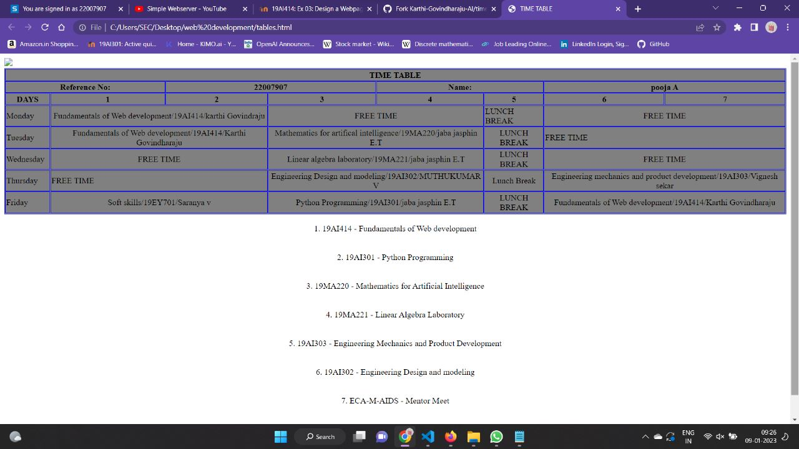

# Experiment_Time_Table

## AIM
To Write a html webpage page to display your timetable.

# ALGORITHM
### STEP 1
create a simple table using table tag
### STEP 2
Add header row using th tag
### STEP 3
Add your timetable
### STEP 4
Execute the program

# CODE
```
<!DOCTYPE html>
<html>

   <head>
      <title>TIME TABLE</title>
   </head>

   <body>
	</img>
      <table border = "1" cellspacing="1" bordercolor="blue" bgcolor="grey">
         <tr>
	     	
            <th colspan="8">TIME TABLE</th>

         </tr>
	<tr>
		<th colspan="2">Reference No:</th>
        	<th colspan="2">22007907</th>
		<th colspan="2">Name:</th>
		<th colspan="2">pooja A</th>
	</tr>
         <tr>
            <th>DAYS</th>
            <th>1</th>
            <th>2</th>
            <th>3</th>
            <th>4</th>
            <th>5</th>
            <th>6</th>
            <th>7</th>
           
         </tr>
       
 
  <tr>
             <td>Monday</td>
             <td colspan="2"><center>Fundamentals of Web development/19AI414/karthi Govindraju</center></td>
             <td colspan="2"><center>FREE TIME</center></td>
             <td><centre>LUNCH BREAK</centre></td>
             <td colspan="2"><center>FREE TIME</center></td>
</tr>
<tr>
             <td>Tuesday</td>
             <td colspan="2"><center>Fundamentals of Web development/19AI414/Karthi Govindharaju</center></td>
             <td colspan="2"><center>Mathematics for artifical intelligence/19MA220/jaba jasphin E.T</center></td></center>
             <td><center>LUNCH BREAK</center></td>
             <td colspan="2"<center>FREE TIME</center></td>
</tr>
<tr>
             <td>Wednesday</td>
             <td colspan="2"><center>FREE TIME</center></td>
             <td colspan="2"><center>Linear algebra laboratory/19MA221/jaba jasphin E.T</center></td>
             <td><center>LUNCH BREAK</center></td>
             <td colspan="2"><center>FREE TIME</center></td>
</tr>
  <tr>
             <td>Thursday</td>
             <td colspan="2"<center></center>FREE TIME</td>
             <td colspan="2"><center>Engineering Design and modeling/19AI302/MUTHUKUMAR V</center></td>
             <td><center>Lunch Break</center></td>
             <td colspan="2"><center>Engineering mechanics and product development/19AI303/Vignesh sekar</center></td></center>
</tr>
<tr>
             <td>Friday</td>
             <td colspan="2"><center>Soft skills/19EY701/Saranya v</center></td>
             <td colspan="2"><center>Python Programming/19AI301/jaba jasphin E.T</center></td>
             <td><center>LUNCH BREAK</center></td>
             <td colspan="2"><center>Fundamentals of Web development/19AI414/Karthi Govindharaju</center></td>
</tr>

 
        
      </table>
    <br><center>1. 19AI414 - Fundamentals of Web development</center></br>
    <br><center>2. 19AI301 - Python Programming</center></br>
    <br><center>3. 19MA220 - Mathematics for Artificial Intelligence</center></br>
    <br><center>4. 19MA221 - Linear Algebra Laboratory</center></br>
    <br><center>5. 19AI303 - Engineering Mechanics and Product Development</center></br>
    <br><center>6. 19AI302 - Engineering Design and modeling</center></br>
    <br><center>7. ECA-M-AIDS - Mentor Meet</center></br>
    <br><center>9. 19EY701-Soft Skills</center></br>
      
     
   </body>
</html>
```

# OUPUT


# Result
The program for creating Slot Timetable is completed successfully.